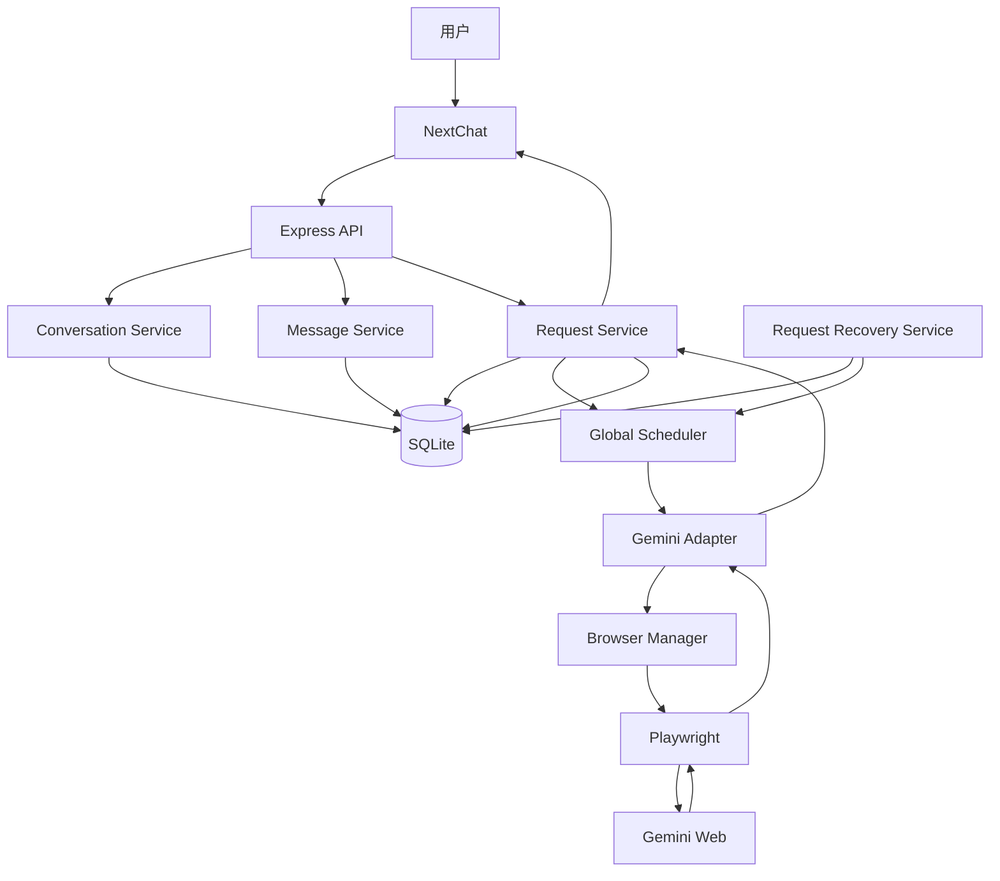
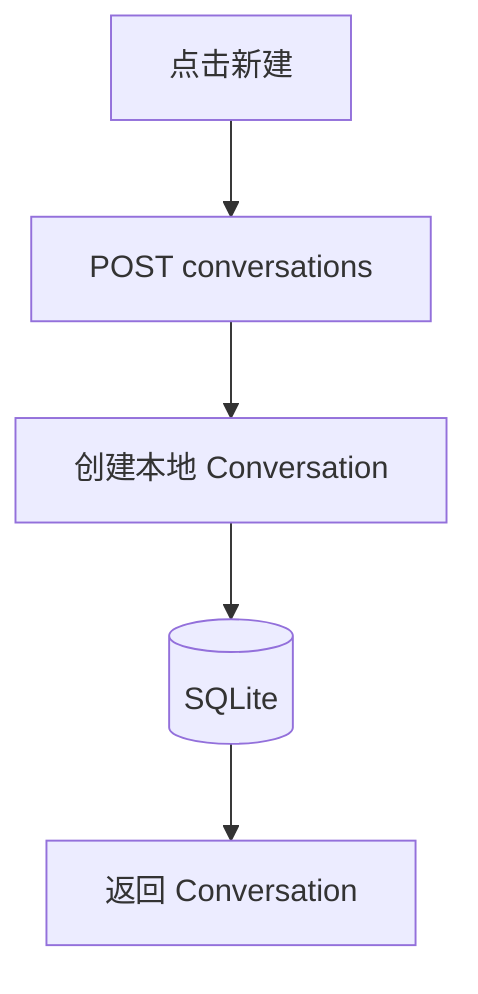
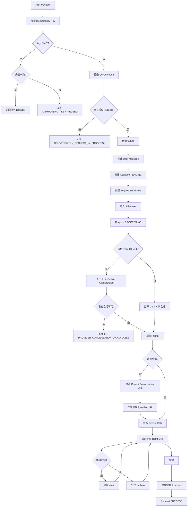
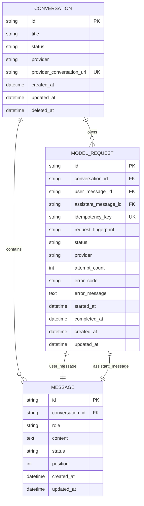
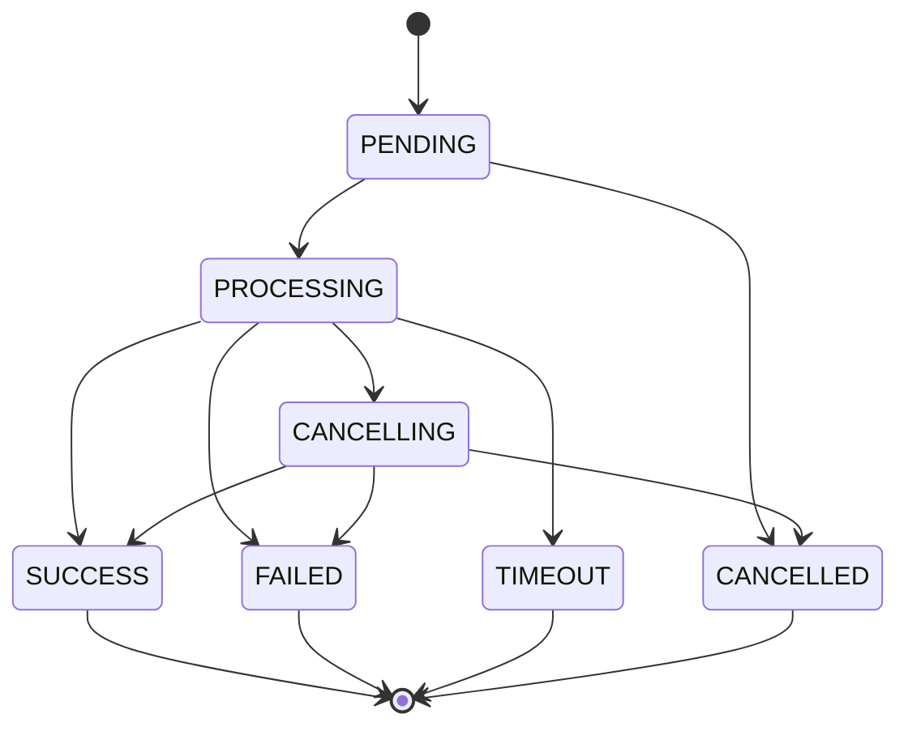

# Gemini Web Chat Proxy 项目开发设计文档 V2

> 本文档作为后续 Codex 开发的设计基线。
>
> 当前项目是新业务项目，但已经存在一个可以正常运行的 NextChat Fork。
>
> **NextChat 作为 UI 基座，不推翻重写。**
>
> 核心技术方向保持：
>
> ```text
> NextChat UI
> +
> Node.js + TypeScript + Express
> +
> SQLite
> +
> Prisma
> +
> Playwright
> +
> Gemini Web
> +
> SSE
> ```
>
> 核心原则：
>
> 1. 数据库是业务数据唯一可信来源。
> 2. Gemini Web 是外部 Provider，不是业务数据源。
> 3. Gemini 自动化必须集中在 Gemini Adapter。
> 4. 第一版 Gemini 最大并发数固定为 1。
> 5. 不自动绕过登录、安全验证、验证码或限流。
> 6. 无法确认 Prompt 是否已经提交时，禁止自动重发。
> 7. Gemini Conversation URL 一旦确定，立即持久化。
> 8. 第 0 阶段完成以前，不允许猜测 NextChat 的具体修改文件。

---

# 1. 项目目标

## 1.1 解决的问题

用户通过自己的聊天网页与 Gemini 对话。

实际调用链：

```text
用户
↓
NextChat
↓
我们的后端
↓
Playwright
↓
Gemini Web
↓
获取 Gemini 回答
↓
我们的后端
↓
NextChat
```

不是调用 Gemini API。

---

## 1.2 核心用户

第一版：

```text
本机单用户
```

即：

```text
项目使用者
=
Gemini 网页账号持有者
=
运行本项目的人
```

---

## 1.3 用户主要功能

用户可以：

* 新建会话
* 查看历史会话
* 切换会话
* 修改会话标题
* 归档会话
* 恢复归档会话
* 删除本地会话
* 输入文本
* 发送消息
* 实时查看 Gemini 回答
* 连续追问
* 停止生成
* 页面刷新后恢复历史消息
* 查看 Gemini 登录状态
* Gemini 登录失效后手动重新登录

---

## 1.4 本期范围

必须完成：

```text
NextChat UI 接入

Conversation
Message
Request

SQLite 持久化
Prisma

Browser Manager
Persistent Browser Profile

Gemini Adapter
Gemini Conversation 映射

全局 Scheduler
最大 Gemini 并发 = 1

SSE
流式回答

请求取消
请求恢复
服务重启恢复

幂等
异常处理
日志

基础自动化测试
人工 Gemini 集成测试
```

---

## 1.5 本期明确不做

```text
多用户

注册登录
JWT
权限系统

Redis
RabbitMQ
Kafka

微服务

Gemini API
OpenAI API

账号池
多 Gemini 账号

验证码绕过
安全验证绕过
限流绕过

图片生成
语音
视频

文件上传

知识库
RAG
Agent

云端 SaaS
```

---

# 2. 技术栈和版本基线

## 2.1 前端

继续使用当前 Fork 的 NextChat。

第 0 阶段已完成真实版本确认（2026-09-02，详见 docs/BASELINE_REPORT.md）：

```text
Next.js           14.1.1（node_modules 实测）
React             18.2.0
TypeScript        5.2.2（devDependencies 声明）
Zustand           4.3.8
包管理器          yarn 1.22.19
Markdown 实现     react-markdown 8（app/components/markdown.tsx）
HTTP 实现         axios + 原生 fetch + @fortaine/fetch-event-source（SSE）
本地存储实现      IndexedDB（idb-keyval），key = chat-next-web-store
                  localStorage 仅降级兜底
```

第一版原则：

```text
不主动升级 NextChat 核心依赖
```

除非存在明确兼容问题。

---

# 2.2 后端

```text
Node.js
TypeScript
Express
Zod
Pino
Prisma
Playwright
```

---

# 2.3 后端核心依赖版本

核心依赖禁止使用：

```text
latest
^x.x.x
*
```

作为开发基线。

锁定：

```text
Express      5.2.1
Prisma       7.10.0
@prisma/client 7.10.0
@prisma/adapter-better-sqlite3 7.10.0
Playwright   1.62.1
TypeScript   5.9.3
```

核心依赖必须在 `package.json` 中保存准确版本。

例如：

```json
{
  "dependencies": {
    "express": "5.2.1",
    "playwright": "1.62.1",
    "@prisma/client": "7.10.0",
    "@prisma/adapter-better-sqlite3": "7.10.0"
  },
  "devDependencies": {
    "prisma": "7.10.0",
    "typescript": "5.9.3"
  }
}
```

其他依赖版本由 lockfile 固定。

---

# 2.4 Node.js 版本规则

第 0 阶段必须实际执行：

```text
node -v
```

不能猜。

后端开发基线要求：

```text
Node.js 24.14.0（第 0 阶段实测，Node 24 LTS 线）
```

至少满足所选 Prisma 和 Playwright 版本要求。

如果当前 Node.js 不满足：

```text
停止第 1 阶段
↓
先升级 Node
↓
再次验证版本
```

不要为了兼容一个过旧 Node.js 而随意降低 Prisma、Playwright 等核心依赖版本。

实际 Node 版本已记录在：

```text
docs/BASELINE_REPORT.md
```

仓库根已新增：

```text
.nvmrc → 24.14.0
```

---

# 2.5 包管理器规则

第 0 阶段已确定实际使用者：

```text
yarn 1.22.19
```

判断依据一致：

```text
package.json 中 packageManager → yarn@1.22.19
实际 lockfile → front/yarn.lock（唯一，无冲突）
```

后端统一使用 Yarn（1.22.19），禁止混用 npm / pnpm，禁止产生多个 lockfile。

后端原则：

```text
尽量与当前仓库使用同一种包管理器
```

不要在同一个仓库混用：

```text
npm
+
yarn
+
pnpm
```

产生多个 lockfile。

---

# 2.6 数据库

```text
SQLite
```

ORM：

```text
Prisma 7.10.0
```

数据库迁移：

```text
Prisma Migrate
```

---

# 2.7 Prisma 7 项目结构

必须使用 Prisma 7 的真实结构（back/ 为根，无 server/ 前缀）：

```text
prisma/
├── schema.prisma
└── migrations/

prisma.config.ts
.env
src/generated/prisma/
```

---

## prisma.config.ts

设计：

```typescript
import "dotenv/config";
import { defineConfig, env } from "prisma/config";

export default defineConfig({
  schema: "prisma/schema.prisma",

  migrations: {
    path: "prisma/migrations",
  },

  datasource: {
    url: env("DATABASE_URL"),
  },
});
```

---

## schema.prisma

连接 URL 不写在：

```text
schema.prisma
```

而由：

```text
prisma.config.ts
```

管理。

设计：

```prisma
generator client {
  provider = "prisma-client"
  output   = "../src/generated/prisma"
}

datasource db {
  provider = "sqlite"
}
```

---

## .env

```env
DATABASE_URL="file:./data/database/app.db"
```

---

# 2.8 其他组件

```text
Redis          不需要
消息队列       不需要
WebSocket      不需要
SSE            需要
对象存储       不需要
定时任务       不需要
Nginx          第一版不需要
Docker         第一版本地开发不需要
```

---

# 3. 系统架构



---

# 3.1 分层职责

## NextChat

负责：

```text
UI
输入
展示
SSE
Loading
Error
Cancel
```

---

## Controller

只负责：

```text
HTTP
参数校验
Service 调用
HTTP Response
```

禁止：

```text
Controller 直接操作 Prisma

Controller 直接操作 Playwright
```

---

## Service

负责：

```text
业务规则
事务
状态流转
幂等
错误转换
```

---

## Repository

负责：

```text
数据库访问
```

---

## Scheduler

负责：

```text
不同 Conversation 请求排队
Gemini 全局串行执行
```

固定：

```text
MAX_GEMINI_CONCURRENCY = 1
```

---

## Browser Manager

负责：

```text
Persistent Context
浏览器生命周期
Page 生命周期
浏览器异常恢复
Profile 使用状态
```

---

## Gemini Adapter

负责所有：

```text
Gemini URL
Gemini DOM
Gemini Selector
Gemini 输入框
发送按钮
停止按钮
Conversation URL
回答读取
生成结束检测
```

Gemini Selector 禁止散落在其他模块。

---

# 4. 项目目录

第 0 阶段已完成（2026-09-02），真实仓库结构：

```text
personChat/
├── front/   NextChat 前端独立 Git 仓库（保持不动）
└── back/    本项目后端 Git 仓库（开发根目录）
```

后端直接以 back/ 为根目录，**不创建 back/server/**。后续所有阶段在此目录内开发：

```text
back/
│
├── src/
│   ├── main.ts
│   ├── app.ts
│   │
│   ├── config/
│   │   ├── env.ts
│   │   └── constants.ts
│   │
│   ├── common/
│   │   ├── errors/
│   │   │   ├── app-error.ts
│   │   │   └── error-codes.ts
│   │   ├── logger/
│   │   │   └── logger.ts
│   │   ├── middleware/
│   │   │   ├── request-id.ts
│   │   │   └── error-handler.ts
│   │   └── utils/
│   │
│   ├── database/
│   │   └── prisma.ts
│   │
│   ├── generated/
│   │   └── prisma/
│   │
│   ├── modules/
│   │   ├── health/
│   │   │   └── health.controller.ts
│   │   ├── conversation/
│   │   ├── message/
│   │   └── request/
│   │
│   ├── recovery/
│   │   └── request-recovery.service.ts
│   │
│   └── providers/
│       └── gemini/
│           ├── browser-manager.ts
│           ├── gemini.adapter.ts
│           ├── gemini.selectors.ts
│           ├── gemini.types.ts
│           └── gemini.errors.ts
│
├── prisma/
│   ├── schema.prisma
│   └── migrations/
│
├── prisma.config.ts
│
├── data/
│   ├── database/
│   ├── browser-profile/
│   └── debug/
│
├── tests/
│   ├── unit/
│   └── integration/
│
├── logs/
│
├── docs/
│   ├── BASELINE_REPORT.md   （第 0 阶段输出，已存在）
│   ├── API.md
│   └── GEMINI_AUTOMATION.md
│
├── .nvmrc           → 24.14.0
├── .env
├── .env.example
├── package.json
├── tsconfig.json
└── prisma.config.ts
```

原设计所有 server/ 前缀取消：

```text
src/...    → src/...
prisma/... → prisma/...
tests/...  → tests/...
```

## NextChat 真实文件（第 0 阶段确认，路径相对 front/）

第 7 阶段修改的核心文件：

```text
app/store/chat.ts
app/components/chat.tsx
app/components/chat-list.tsx
app/components/sidebar.tsx
app/components/settings.tsx
app/client/api.ts
app/client/controller.ts
app/utils/indexedDB-storage.ts
app/utils/store.ts
```

保留复用：

```text
app/components/markdown.tsx   Markdown / 代码高亮 / Mermaid 渲染
```

完整清单与行号见 docs/BASELINE_REPORT.md。

---

# 5. 功能模块

## Conversation

负责：

```text
创建
列表
详情
标题
归档
恢复
软删除
Gemini Conversation URL
```

---

## Message

负责：

```text
User Message
Assistant Message
消息历史
排序
展示状态
```

---

## Request

一次：

```text
User Message
→
Gemini
→
Assistant Message
```

对应一个 Request。

负责：

```text
状态
幂等
执行
错误
取消
超时
```

---

## Scheduler

负责全局 Gemini 执行槽。

不同 Conversation：

```text
允许创建 Request
↓
进入全局队列
```

同一 Conversation：

```text
禁止存在两个活动 Request
```

---

## Request Recovery

负责服务启动后的遗留 Request。

---

## Browser Manager

负责浏览器。

---

## Gemini Adapter

负责 Gemini 页面。

---

# 6. 核心业务流程

# 6.1 创建本地会话



创建时：

```text
provider_conversation_url = NULL
```

此时不访问 Gemini。

---

# 6.2 发送消息完整流程



---

# 6.3 Gemini Conversation URL 保存规则

旧设计禁止继续使用：

```text
回答全部完成
↓
保存 Conversation URL
```

新规则：

```text
打开 Gemini 新会话
↓
发送 Prompt
↓
Gemini 创建真实 Conversation
↓
检测浏览器 URL
↓
立即保存 provider_conversation_url
↓
之后才继续监听完整回答
```

原则：

> Provider Conversation URL 一旦确定，立即持久化。

不能等待整个回答结束。

---

## 保存 URL 的事务

独立短事务：

```text
BEGIN

更新 conversation.provider_conversation_url

更新 conversation.updated_at

COMMIT
```

URL 保存失败：

```text
当前 Request FAILED
```

不能继续假装会话映射成功。

---

# 6.4 已有 Provider Conversation

如果本地：

```text
provider_conversation_url != NULL
```

必须打开这个 URL。

如果 Gemini：

```text
会话被删除
URL失效
发生重定向
找不到对应会话
```

禁止：

```text
自动创建新 Gemini Conversation
```

必须：

```text
Request FAILED
```

错误：

```text
PROVIDER_CONVERSATION_UNAVAILABLE
```

前端提示：

```text
Gemini 原始会话已不可用，请创建新的本地会话。
```

---

# 6.5 同一 Conversation 连续发送规则

统一为：

## 同一个 Conversation

如果已经存在：

```text
PENDING
PROCESSING
CANCELLING
```

Request：

```text
禁止继续发送
```

前端：

```text
Send Disabled
```

后端：

```text
409
CONVERSATION_REQUEST_IN_PROGRESS
```

不能排队第二个问题。

原因：

上一条 Gemini 回答还没有形成稳定上下文。

---

## 不同 Conversation

允许同时提交。

例如：

```text
Conversation A → PROCESSING
Conversation B → PENDING
Conversation C → PENDING
```

由全局 Scheduler 排队。

---

# 7. 数据库设计

核心表：

```text
conversations
messages
model_requests
```

---

# 7.1 Conversation

关键字段：

```text
id
title
status
provider
provider_conversation_url
created_at
updated_at
deleted_at
```

status：

```text
ACTIVE
ARCHIVED
DELETED
```

---

# 7.2 Message

```text
id
conversation_id
role
content
status
position
created_at
updated_at
```

role：

```text
USER
ASSISTANT
```

Message 状态：

```text
PENDING
STREAMING
COMPLETED
FAILED
CANCELLED
```

---

# 7.3 Model Request

增加：

```text
request_fingerprint
```

完整字段：

```text
id

conversation_id

user_message_id
assistant_message_id

idempotency_key
request_fingerprint

status

provider

attempt_count

error_code
error_message

started_at
completed_at

created_at
updated_at
```

---

# 7.4 Idempotency Fingerprint

计算内容：

```text
conversationId
+
原始 content
```

推荐：

```text
SHA-256(
  canonical JSON {
    conversationId,
    content
  }
)
```

---

# 7.5 Idempotency 规则

收到 Request：

```text
Idempotency-Key = abc
```

先查询：

```text
model_requests.idempotency_key
```

---

## Key 不存在

创建正常 Request。

---

## Key 已存在 + fingerprint 相同

直接返回原：

```text
Request
User Message
Assistant Message
```

不得创建新数据。

---

## Key 已存在 + fingerprint 不同

返回：

```text
HTTP 409
IDEMPOTENCY_KEY_REUSED
```

不得返回第一次 Request。

不得创建新数据。

---

# 7.6 活动 Request 唯一性

数据库必须保护：

```text
同一个 Conversation
最多一个：

PENDING
PROCESSING
CANCELLING
```

除了 Service 检查之外：

初始 migration 增加 SQLite Partial Unique Index：

```sql
CREATE UNIQUE INDEX uk_active_request_per_conversation
ON model_requests(conversation_id)
WHERE status IN (
    'PENDING',
    'PROCESSING',
    'CANCELLING'
);
```

这样即使两个 HTTP 请求同时进入：

数据库仍然兜底。

---

# 7.7 Request 状态 CHECK

数据库 Request CHECK 必须包含：

```text
PENDING
PROCESSING
CANCELLING
SUCCESS
FAILED
CANCELLED
TIMEOUT
```

---

# 7.8 数据关系



---

# 8. API 设计

统一：

```text
/api
```

---

# 8.1 Conversation 列表

```text
GET /api/conversations
```

默认：

```text
status=ACTIVE
```

支持：

```text
GET /api/conversations?status=ACTIVE

GET /api/conversations?status=ARCHIVED
```

`DELETED`：

普通 API 不返回。

---

# 8.2 创建会话

```text
POST /api/conversations
```

---

# 8.3 会话详情

```text
GET /api/conversations/:id
```

---

# 8.4 修改 Conversation

```text
PATCH /api/conversations/:id
```

允许修改：

```json
{
  "title": "Java问题"
}
```

或者：

```json
{
  "status": "ARCHIVED"
}
```

恢复：

```json
{
  "status": "ACTIVE"
}
```

---

## DELETED

禁止：

```text
PATCH
DELETED → ACTIVE
```

删除后普通 PATCH 返回：

```text
409
CONVERSATION_DELETED
```

---

## 正在执行 Request

存在：

```text
PENDING
PROCESSING
CANCELLING
```

时：

禁止归档或删除。

返回：

```text
409
CONVERSATION_REQUEST_IN_PROGRESS
```

---

# 8.5 删除

```text
DELETE /api/conversations/:id
```

只软删除本地。

不自动删除 Gemini 原始 Conversation。

---

# 8.6 Message List

```text
GET /api/conversations/:id/messages
```

Assistant Message 如果有关联 Request：

必须同时返回 Request 信息。

例如：

```json
{
  "data": [
    {
      "id": "assistant-001",
      "role": "ASSISTANT",
      "content": "",
      "status": "FAILED",
      "request": {
        "id": "request-001",
        "status": "FAILED",
        "errorCode": "PROVIDER_LOGIN_REQUIRED",
        "errorMessage": "Gemini 登录已失效"
      }
    }
  ]
}
```

这样：

```text
刷新页面
```

以后仍然能看到真实错误原因。

错误信息只保存在：

```text
model_requests
```

不复制到 Message。

---

# 8.7 发送消息

```text
POST /api/conversations/:id/messages
```

Header：

```text
Idempotency-Key: UUID
```

Body：

```json
{
  "content": "你好"
}
```

---

## 发送前检查顺序

```text
参数校验

↓

Idempotency Key 查询

↓

Conversation 是否存在

↓

Conversation 是否 ACTIVE

↓

是否已有活动 Request

↓

事务创建 Message + Request
```

---

# 8.8 SSE

```text
GET /api/requests/:requestId/events
```

事件：

```text
snapshot
delta
replace
status
completed
failed
cancelled
heartbeat
```

---

# 8.9 Cancel

```text
POST /api/requests/:requestId/cancel
```

PENDING：

```text
PENDING
↓
CANCELLED
```

不操作 Gemini。

PROCESSING：

```text
PROCESSING
↓
CANCELLING
↓
调用 Gemini stop
↓
确认真正停止
↓
CANCELLED
```

---

# 9. NextChat 页面和功能兼容

第 0 阶段检查真实源码后：

必须更新：

```text
docs/BASELINE_REPORT.md
```

并最终补齐准确文件路径。

---

## 功能兼容表（第 0 阶段实测后更新）

| NextChat 功能           | 本期处理                   |
| ----------------------- | -------------------------- |
| Chat UI                 | 保留                       |
| 消息布局                  | 保留                       |
| 会话列表                  | UI 保留，数据改为后端         |
| IndexedDB 会话数据        | 停止作为业务可信来源         |
| localStorage 兜底        | 停止作为业务可信来源         |
| 原 Provider              | 绕开                       |
| OpenAI Provider         | 不用于业务                  |
| Gemini API Provider     | 绕开（本项目是 Gemini Web 自动化，与其无关） |
| 模型切换                  | 第一版隐藏                  |
| API Key / Endpoint      | 隐藏                       |
| 文件上传                  | 第一版隐藏                  |
| 图片能力                  | 第一版隐藏                  |
| DALL-E / Stable Diffusion | 第一版隐藏                 |
| 重新生成 Regenerate      | 第一版关闭                  |
| Stop Generate           | 接我们的 Request Cancel    |
| Markdown                | 保留                       |
| 代码高亮                  | 保留                       |
| Mermaid                 | 保留（实测存在）            |
| Theme                   | 保留                       |
| UI Settings             | 保留                       |
| 本地 Export Chat        | 保留（Markdown/JSON/PNG）   |
| ShareGPT 分享            | 关闭（消息不得离开本机）      |
| WebDAV / Upstash 同步    | 第一版关闭                  |
| SearchChat              | 第一版隐藏                  |
| Delete Chat             | 接 Conversation API        |
| Archive Chat            | 新增（fork 没有归档概念）    |
| Rename Chat             | 接 Conversation API        |

### SearchChat 第一版隐藏的原因

```text
当前搜索依赖浏览器本地 Session 数据。
未来 SQLite 才是完整消息数据源。
未开发后端搜索 API 前继续开放会产生不完整搜索结果。
```

### 删除撤销规则

当前 NextChat 的 deleteSession 带 5 秒撤销 Toast，与目标 Conversation 状态设计冲突。

第一版：

```text
关闭删除后的 5 秒撤销功能。
```

继续采用：

```text
ACTIVE
↔
ARCHIVED

ACTIVE / ARCHIVED
→
DELETED
```

`DELETED` 不允许通过普通 Conversation PATCH 恢复。

---

# 10. NextChat 核心组件

准确文件路径（第 0 阶段已确定，路径相对 front/，详见 docs/BASELINE_REPORT.md）：

```text
app/components/home.tsx        路由入口（HashRouter）
app/components/chat.tsx        聊天窗口（输入/消息/工具栏主体）
app/components/chat-list.tsx   会话列表
app/components/sidebar.tsx     侧栏
app/components/settings.tsx    设置页
app/components/exporter.tsx    导出
app/components/markdown.tsx    Markdown/代码高亮/Mermaid
app/store/chat.ts              会话与消息 store
app/client/api.ts              Provider 客户端工厂
app/client/controller.ts       Stop 控制器池
app/utils/indexedDB-storage.ts 本地持久化适配器（需替换）
```

注意：上游的组件划分（ChatLayout/MessageList/ProviderStatus 等）在本 fork 中不存在，聊天相关 UI 集中在 chat.tsx 内，以实际文件为准。

原则：

尽量修改现有组件。

不要重新创建另一套：

```text
ChatLayoutV2
NewChatWindow
CustomMessageList
```

导致两套聊天系统长期并存。

---

# 11. 状态设计

# 11.1 Request 状态机



---

## CANCELLING → SUCCESS

只允许特殊竞争情况：

```text
用户点击取消
↓
进入 CANCELLING
↓
但 Gemini 在 stop 生效前已经正常完成
↓
Adapter 明确确认生成完成
↓
SUCCESS
```

不能人为强制标为 CANCELLED。

---

# 11.2 Scheduler 释放条件

Scheduler 不能仅根据：

```text
用户点击 Cancel
```

释放执行槽。

必须满足：

```text
Request 已进入终态

SUCCESS
FAILED
TIMEOUT
CANCELLED
```

并且：

```text
Browser Manager / Gemini Adapter
确认当前页面已经不存在仍在进行的生成
```

才允许执行下一条。

---

# 11.3 Cancel 无法确认

例如：

```text
点击 Stop
↓
没有确认 Gemini 停止
```

不能：

```text
CANCELLING
↓
直接 CANCELLED
↓
执行下一条
```

必须：

```text
CANCELLING
↓
尝试确认
↓
确认失败
↓
FAILED
```

错误：

```text
PROVIDER_CANCELLATION_UNCONFIRMED
```

之后：

```text
Browser Manager 重新初始化 Page / Context
↓
确认 Provider READY
↓
Scheduler 才能继续
```

如果重新初始化失败：

```text
Provider ERROR
Scheduler 暂停
```

---

# 11.4 Request 和 Assistant Message 状态同步

统一由：

```text
Request Service
```

负责。

映射：

| Request    | Assistant Message |
| ---------- | ----------------- |
| PENDING    | PENDING           |
| PROCESSING | STREAMING         |
| CANCELLING | STREAMING         |
| SUCCESS    | COMPLETED         |
| FAILED     | FAILED            |
| TIMEOUT    | FAILED            |
| CANCELLED  | CANCELLED         |

禁止：

```text
Gemini Adapter
Message Service
Controller
```

分别自行修改这些状态。

所有状态变化通过：

```text
RequestService.transition(...)
```

统一完成。

---

# 12. 异常、恢复、并发和一致性

# 12.1 服务启动 Request 恢复

内存 Scheduler 会在服务重启后丢失。

因此后端启动必须首先执行：

```text
Request Recovery Service
```

---

## PENDING

表示：

```text
还没有开始操作 Gemini
```

启动时：

```text
查询 PENDING
↓
检查数据完整
↓
重新加入 Scheduler
```

允许自动恢复。

---

## PROCESSING

禁止重新加入 Scheduler。

原因：

无法确认：

```text
Prompt 是否已经提交给 Gemini
```

启动时：

```text
PROCESSING
↓
FAILED
```

错误：

```text
SERVER_RESTARTED_DURING_PROCESSING
```

Assistant：

```text
FAILED
```

保留：

```text
User Message
Assistant Message
Request
Provider Conversation URL
```

禁止自动重新发送 Prompt。

---

## CANCELLING

同样无法确认：

```text
Gemini 是否真正停止
```

启动时：

```text
CANCELLING
↓
FAILED
```

错误：

```text
SERVER_RESTARTED_DURING_CANCELLING
```

禁止自动发送原 Prompt。

---

## 启动顺序

```text
加载配置
↓
连接数据库
↓
执行 Request Recovery
↓
启动 Browser Manager
↓
恢复 PENDING Scheduler
↓
启动 HTTP 服务
```

HTTP 开始接受新的 Message 前：

Recovery 必须执行完成。

---

# 12.2 Browser 崩溃

如果：

```text
Chromium 崩溃
Browser Context 崩溃
```

当前 PROCESSING：

```text
↓
FAILED
```

错误：

```text
PROVIDER_BROWSER_CRASHED
```

禁止自动重发 Prompt。

Browser Manager：

```text
尝试重新初始化 Browser
```

PENDING Request：

继续保留等待。

只有 Provider：

```text
READY
```

以后 Scheduler 才继续。

---

# 12.3 Page 被关闭

当前 Request：

```text
FAILED
```

错误：

```text
PROVIDER_PAGE_CLOSED
```

禁止自动重新执行原 Request。

---

# 12.4 导航失败

```text
PROVIDER_NAVIGATION_FAILED
```

如果此前 Prompt 是否提交无法确认：

禁止自动重试。

---

# 12.5 Browser Profile 规则

必须使用项目专用：

```text
data/browser-profile/
```

禁止直接使用：

```text
用户日常 Chrome Default Profile
```

例如禁止：

```text
C:\Users\xxx\AppData\Local\Google\Chrome\User Data\Default
```

原因：

```text
Profile 文件锁
多个进程竞争
浏览器互相干扰
Profile 损坏
```

---

## Persistent Context

Browser Manager 使用：

```text
data/browser-profile
```

创建：

```text
launchPersistentContext
```

---

## 单实例

一个后端进程：

```text
只能存在一个 BrowserManager
```

同一个：

```text
BROWSER_PROFILE_DIR
```

同一时间只允许一个自动化 Browser Context。

如果 Playwright 判断 Profile 正在被其他进程使用：

返回：

```text
PROVIDER_PROFILE_IN_USE
```

禁止强制绕过 Profile Lock。

---

# 12.6 SSE DOM 差分算法

禁止假设 Gemini DOM 永远：

```text
只在尾部 append
```

Gemini 可能重新渲染整个回答节点。

Adapter 每次获取：

```text
currentContent
```

同时保存：

```text
previousContent
```

---

## 情况 A：内容没变化

```text
currentContent === previousContent
```

不发送事件。

---

## 情况 B：正常追加

```text
currentContent.startsWith(previousContent)
```

计算：

```text
delta =
currentContent.substring(previousContent.length)
```

发送：

```text
event: delta
```

前端：

```text
content += delta
```

---

## 情况 C：Gemini 修改了前文

如果：

```text
!currentContent.startsWith(previousContent)
```

禁止计算错误 delta。

发送：

```text
event: replace
```

Payload：

```json
{
  "content": "当前完整回答"
}
```

前端：

```text
content = currentContent
```

---

## snapshot

`snapshot` 专门用于：

```text
首次连接 SSE
重新连接 SSE
页面刷新恢复
```

内容：

```json
{
  "requestId": "...",
  "messageId": "...",
  "status": "PROCESSING",
  "content": "当前数据库已经保存的完整内容"
}
```

前端：

```text
content = snapshot.content
```

---

## previousContent 更新

任何：

```text
delta
replace
```

成功生成后：

```text
previousContent = currentContent
```

---

# 12.7 流式数据数据库保存

不能每个字符：

```text
UPDATE SQLite
```

采用：

```text
内存最新完整内容
+
定时 flush
```

默认：

```text
1000ms
```

最终：

```text
SUCCESS
FAILED
CANCELLED
TIMEOUT
```

前必须强制执行一次最终保存。

---

# 12.8 请求事务

发送消息：

```text
BEGIN

检查 Conversation ACTIVE

检查无活动 Request

创建 User Message

创建 Assistant Message

创建 Request

更新 Conversation.updated_at

COMMIT
```

任何失败：

```text
ROLLBACK
```

---

# 12.9 Provider URL 事务

首次 Gemini Conversation URL 一旦获得：

独立立即持久化。

不能等待 Assistant 完成。

---

# 12.10 Gemini 成功事务

```text
Assistant.content = 最终内容
Assistant.status = COMPLETED

Request.status = SUCCESS

Request.completed_at = now

Conversation.updated_at = now
```

一次事务提交。

---

# 12.11 Gemini 失败

保留 User Message。

```text
Assistant.status = FAILED

Request.status = FAILED

Request.error_code
Request.error_message
```

---

# 12.12 并发和重复提交

前端 Disable 只能改善体验。

真正安全依靠：

```text
Idempotency-Key

数据库 UNIQUE

Conversation 活动 Request 唯一索引

事务
```

---

# 12.13 统一错误码

新增后至少包括：

```text
VALIDATION_ERROR

CONVERSATION_NOT_FOUND
CONVERSATION_DELETED
CONVERSATION_ARCHIVED
CONVERSATION_REQUEST_IN_PROGRESS

IDEMPOTENCY_KEY_REUSED

REQUEST_NOT_FOUND

PROVIDER_NOT_READY
PROVIDER_LOGIN_REQUIRED
PROVIDER_PROFILE_IN_USE

PROVIDER_BROWSER_CRASHED
PROVIDER_PAGE_CLOSED

PROVIDER_NAVIGATION_FAILED
PROVIDER_DOM_CHANGED

PROVIDER_RESPONSE_TIMEOUT
PROVIDER_RATE_LIMITED

PROVIDER_CONVERSATION_UNAVAILABLE

PROVIDER_CANCELLATION_UNCONFIRMED

SERVER_RESTARTED_DURING_PROCESSING
SERVER_RESTARTED_DURING_CANCELLING

DATABASE_ERROR
INTERNAL_ERROR
```

---

# 13. 边界条件

必须覆盖：

```text
空输入
纯空格
换行

超长 Prompt

中文
Emoji
Markdown
代码
特殊字符

重复点击

同 Idempotency Key 同内容

同 Idempotency Key 不同内容

同 Conversation 连续发送

不同 Conversation 同时发送

页面刷新

SSE 断开

SSE 重连

Gemini DOM 重新渲染

Gemini 修改已经生成的前文

用户 Cancel

Cancel 失败

Cancel 与正常完成竞争

浏览器崩溃

Page 被关闭

Provider URL 失效

Gemini 会话被用户手工删除

服务器 PROCESSING 时重启

服务器 PENDING 时重启

数据库不可用

Gemini 登录失效

Gemini 限流
```

---

# 14. 安全设计

第一版：

```text
本机单用户
无我们的登录系统
```

服务默认：

```text
127.0.0.1
```

禁止默认：

```text
0.0.0.0
```

---

## CORS

只允许配置的 NextChat Origin。

禁止：

```text
*
```

---

## Browser Profile

必须加入 `.gitignore`：

```text
data/browser-profile/
```

---

## 其他敏感文件

禁止提交：

```text
.env
data/database/
data/debug/
logs/
```

---

## 日志禁止记录

```text
Cookie
Token
Authorization
Google Session
密码
完整 Prompt
```

默认只记录：

```text
conversationId
messageId
requestId
contentLength
耗时
错误码
```

---

## Gemini 安全验证

遇到：

```text
验证码
重新登录
Google 安全检查
```

自动化停止。

提示用户人工处理。

---

# 15. 测试方案

## 单元测试

重点增加：

```text
Request 状态机

CANCELLING

Request / Message 状态同步

Idempotency Fingerprint

同 Key 同内容

同 Key 不同内容

Conversation 活动 Request 限制

SSE delta

SSE replace

Request Recovery
```

---

## API Test

覆盖：

```text
Conversation CRUD

Archive
Unarchive

Message Send

Duplicate Idempotency

Idempotency Conflict

Conversation Request In Progress

Cancel
```

---

## Recovery Test

必须模拟：

### PENDING + Server Restart

结果：

```text
重新进入 Scheduler
```

---

### PROCESSING + Server Restart

结果：

```text
FAILED

SERVER_RESTARTED_DURING_PROCESSING
```

不得调用 Fake Provider 第二次。

---

### CANCELLING + Server Restart

结果：

```text
FAILED

SERVER_RESTARTED_DURING_CANCELLING
```

---

# Browser Test

模拟：

```text
browser disconnected

page close

navigation fail
```

必须保证：

```text
原 Request 不自动重发
```

---

# SSE Test

测试：

### previous

```text
abc
```

current：

```text
abcdef
```

输出：

```text
delta = def
```

---

### previous

```text
abcde
```

current：

```text
abXYZ
```

输出：

```text
replace = abXYZ
```

不能发送错误 delta。

---

# Provider Conversation Test

本地：

```text
provider_conversation_url
```

存在。

Fake Provider 返回：

```text
conversation unavailable
```

必须：

```text
FAILED
PROVIDER_CONVERSATION_UNAVAILABLE
```

禁止调用：

```text
createNewConversation()
```

---

# 16. 验收标准

除原验收要求外，增加：

## 第 0 阶段

必须明确得到：

```text
真实 Node Version
真实包管理器
真实 NextChat Git Version
Next.js Version
React Version

真实 Chat 入口
真实 Store
真实 Provider 调用链
真实 Markdown 入口
真实 Settings
真实文件上传
真实重新生成
真实 Stop Generate
```

---

## Request Recovery

服务存在：

```text
PENDING
```

Request 时重启：

重启后 Request 可以继续排队。

---

服务存在：

```text
PROCESSING
```

Request 时重启：

必须：

```text
FAILED
SERVER_RESTARTED_DURING_PROCESSING
```

不能再次调用 Provider。

---

## Conversation URL

Gemini 第一次发送成功创建 Conversation 后：

在完整回答完成前：

数据库必须已经保存：

```text
provider_conversation_url
```

---

## SSE

DOM 纯追加：

```text
delta
```

DOM 前文变化：

```text
replace
```

前端最终内容不得出现重复。

---

## Cancel

点击停止：

不能立刻释放 Scheduler。

必须：

```text
CANCELLING
↓
确认停止
↓
CANCELLED
```

---

## Idempotency

同 Key + 同内容：

只存在：

```text
1 Request
1 User Message
1 Assistant Message
```

同 Key + 不同内容：

```text
409
IDEMPOTENCY_KEY_REUSED
```

---

## 同 Conversation

已有活动 Request 时：

第二次发送：

```text
409
CONVERSATION_REQUEST_IN_PROGRESS
```

---

## 不同 Conversation

可以同时创建 Request。

但 Gemini：

```text
一次只执行一个
```

---

## Provider Conversation

Gemini 原始会话失效：

不能偷偷创建新会话。

---

# 17. 完整开发阶段

# 第 0 阶段：NextChat 基座检查

> ✅ 已完成并验收通过（2026-09-02），输出见 docs/BASELINE_REPORT.md。本章保留作历史记录。

**只读。**

禁止：

```text
修改文件
安装依赖
升级依赖
格式化代码
删除代码
```

---

## 检查内容

### 环境

```text
Node.js
包管理器
```

### Git

```text
当前 Commit
Tag
Branch
Remote
```

### NextChat

```text
版本
Next.js
React
TypeScript
```

### 源码

确认：

```text
Chat 页面入口

会话 Store

Message Store

LocalStorage

IndexedDB

消息发送入口

Provider 调用入口

Provider 完整调用链

Markdown 渲染入口

Conversation List

Settings

模型切换

文件上传

图片功能

重新生成

Stop Generate

删除会话

导出会话
```

---

## 第 0 阶段输出

创建分析结果时先向用户报告，不修改项目。

必须输出：

```text
1. 当前真实架构

2. Node / 包管理器 / 核心版本

3. 当前目录结构

4. 当前 Chat 调用链

5. 当前数据存储方式

6. 可以直接复用的功能

7. 必须绕开的功能

8. 必须隐藏的功能

9. 后续预计修改文件

10. 与设计文档不一致的地方

11. 第 1 阶段是否可以开始
```

完成后才允许确定：

```text
前端准确修改路径
```

---

# 第 1 阶段：后端骨架

开发：

```text
TypeScript
Express
Zod
Pino

Prisma
SQLite

Health
配置
错误体系
```

不开发 Gemini。

---

# 第 2 阶段：数据库与核心业务

> 第 2 阶段实现记录（2026-09-02）：
>
> - user Message 的 status 落地为 COMPLETED（assistant 消息状态枚举不适用于 user 消息）。
> - 活动 Request 唯一约束：SQLite 不支持 Prisma partial index，在 migration 中手工实现等价 partial unique index（见 migration.sql 的 uk_active_request_per_conversation）。
> - Message/ModelRequest/Conversation 的 role/status 字段在 migration 中补充了数据库 CHECK 约束。
> - ARCHIVED 会话发送消息返回 409 CONVERSATION_ARCHIVED（§12.13 已同步补充）。
> - API 响应统一 `{ data: ... }`，错误统一 `{ error: { code, message, requestId } }`。

> 第 2.1 阶段收尾修正（2026-09-02）：
>
> - POST messages：首次成功创建 Request → **202 Accepted**；同 Idempotency-Key 命中 → 200 OK。
> - Message List：仅 ASSISTANT 消息附带 request 摘要，USER 消息 request 恒为 null。
> - 并发不变量（只有 ACTIVE Conversation 能产生活动 Request；存在活动 Request 时禁止归档/删除）由**数据库 Trigger** 保护（migration 20260902150000_phase_2_1_concurrency_guards），不依赖先 SELECT 再 UPDATE；应用层把 trigger abort 映射回业务 409。
> - Prisma/SQLite 未识别异常统一 → 500 DATABASE_ERROR，内部细节只写服务端日志、不回传响应。

开发：

```text
Conversation
Message
Request

数据库模型

事务

Idempotency

活动 Request 唯一约束

Archive
```

使用 Fake Provider。

---

# 第 3 阶段：Browser Manager

开发：

```text
专用 Profile

Persistent Context

单实例 Browser

Page

登录状态

Browser crash

Page close

Profile lock
```

---

# 第 4 阶段：Gemini Adapter 最小验证

只实现：

```text
打开 Gemini

检查登录

打开新 Conversation

发送 Prompt

获取 Conversation URL

立即保存 URL

读取最终回答
```

暂不做 SSE。

这是整个项目：

```text
最重要技术验证阶段
```

---

# 第 5 阶段：Request + Scheduler

实现：

```text
PENDING
PROCESSING
CANCELLING
SUCCESS
FAILED
TIMEOUT
CANCELLED

全局队列

同 Conversation 限制

Cancel

Recovery
```

---

# 第 6 阶段：SSE

实现：

```text
snapshot
delta
replace
status
completed
failed
cancelled
heartbeat
```

并完成 DOM 全量文本差分算法。

---

# 第 7 阶段：NextChat 正式接入

只有现在才正式改 NextChat。

根据：

```text
第 0 阶段真实文件报告
```

修改准确文件。

完成：

```text
Conversation API
Message API
Request API
SSE
Cancel
Archive

数据库替代浏览器业务数据
```

同时：

```text
绕开原 Provider
隐藏模型切换
隐藏 API Key
隐藏文件上传
关闭 Regenerate
```

---

# 第 8 阶段：异常、恢复和边界

完成：

```text
服务器重启

Browser Crash

Page Close

Login Expired

DOM Changed

Conversation Unavailable

Cancel Failure

SSE Reconnect

Idempotency Conflict

数据库异常
```

---

# 第 9 阶段：完整测试与验收

执行：

```text
Unit
API
Integration
Recovery
Fake Provider
Manual Gemini Integration
```

逐条执行验收标准。

---

# 18. 第 0 阶段启动步骤

> ✅ 已完成并验收通过（2026-09-02），本章保留作历史记录。

当时的第一件事：

**不是创建 server。**

而是检查当前项目。

Codex 必须保持只读。

---

## 建议检查命令

PowerShell：

```powershell
node -v

git status --short

git branch --show-current

git rev-parse HEAD

git describe --tags --always

git remote -v

Get-Content package.json
```

检查 lockfile：

```powershell
Get-ChildItem package-lock.json,yarn.lock,pnpm-lock.yaml -ErrorAction SilentlyContinue
```

查看 Git 中真实文件：

```powershell
git ls-files
```

源码搜索优先使用：

```powershell
git grep -n "localStorage"

git grep -n "indexedDB"

git grep -n "idb-keyval"

git grep -n "zustand"

git grep -n "react-markdown"

git grep -n "mermaid"

git grep -n "regenerate"

git grep -n "abort"

git grep -n "upload"
```

除此之外：

Codex 应使用代码搜索能力继续追踪：

```text
Message Send

↓

Store Action

↓

API / Provider

↓

真正 HTTP 调用
```

不能仅通过关键词搜索就结束。

---

# 第 0 阶段验收

必须明确回答：

```text
当前消息点击发送以后，

到底依次经过哪些函数和文件？
```

以及：

```text
当前 Conversation 到底存在哪里？
```

如果这两个问题没有追踪清楚：

```text
第 0 阶段未完成
```

---

# 第 1 阶段安装规则

只有第 0 阶段确认：

```text
Node
Package Manager
```

以后才能执行。

核心版本必须固定：

```text
Express 5.2.1

Prisma 7.10.0

@prisma/client 7.10.0

@prisma/adapter-better-sqlite3 7.10.0

Playwright 1.62.1

TypeScript 5.9.3
```

禁止：

```text
npm install prisma@latest
```

或者类似命令。

---

# Prisma 初始化

Prisma 固定：

```text
7.10.0
```

第 1 阶段采用真实 Prisma 7 结构，文件手工创建（结构见 §2.7），不需要旧版 prisma init 交互流程：

```text
prisma/schema.prisma
prisma.config.ts
.env

prisma generate → 输出到 src/generated/prisma/
```

最终必须生成：

```text
prisma/schema.prisma

prisma.config.ts

.env
```

确认这些文件内容以后：

才能开始写 Model。

---

# 19. 完整文件规划

新增后端文件（相对 back/ 仓库根，无 server/ 前缀）：

```text
.nvmrc

.gitignore

package.json

tsconfig.json

.env
.env.example

prisma.config.ts

prisma/schema.prisma

prisma/migrations/

src/main.ts
src/app.ts

src/config/env.ts
src/config/constants.ts

src/database/prisma.ts

src/common/errors/app-error.ts
src/common/errors/error-codes.ts

src/common/logger/logger.ts

src/common/middleware/error-handler.ts
src/common/middleware/request-id.ts

src/modules/health/

src/modules/conversation/
src/modules/message/
src/modules/request/

src/recovery/request-recovery.service.ts

src/providers/gemini/browser-manager.ts
src/providers/gemini/gemini.adapter.ts
src/providers/gemini/gemini.selectors.ts
src/providers/gemini/gemini.types.ts
src/providers/gemini/gemini.errors.ts

src/generated/prisma/

tests/unit/
tests/integration/

docs/PROJECT_DESIGN.md

docs/BASELINE_REPORT.md

docs/API.md

docs/GEMINI_AUTOMATION.md
```

---

## NextChat 文件

暂时禁止在设计文档中写死类似：

```text
app/components/chat.tsx

app/store/chat.ts
```

这样的路径。

统一写：

```text
<第0阶段确认>
```

完成第 0 阶段后：

更新：

```text
docs/BASELINE_REPORT.md
```

再补齐准确路径。

---

# 20. 待确认问题

当前不存在需要用户立即做业务选择的问题。

以下信息由第 0 阶段自动查清：

```text
当前 Node.js 版本

当前包管理器

当前 NextChat 版本

当前 NextChat 目录

真实消息发送入口

真实 Provider 调用链

真实 Store

LocalStorage / IndexedDB

准确修改文件
```

这些不是需要猜测的问题。

必须读取真实项目得到答案。

---

# 第 0 阶段可能出现的阻塞情况

## 情况 1：Node 版本不兼容

结果：

```text
暂停第 1 阶段
```

先调整 Node。

---

## 情况 2：存在多个 lockfile

例如：

```text
yarn.lock
+
pnpm-lock.yaml
```

结果：

需要先明确实际包管理器。

---

## 情况 3：Fork 与当前 NextChat 上游结构差异很大

不改变总体架构。

只重新确定：

```text
第 7 阶段需要修改的真实前端文件
```

---

# 最终开发执行原则

1. 第 0 阶段只读。
2. 第 0 阶段完成前禁止猜测 NextChat 文件。
3. 第 0 阶段完成前禁止开始正式前端改造。
4. 核心依赖使用固定版本。
5. 不主动升级 NextChat。
6. 数据库是业务唯一可信来源。
7. 一个本地 Conversation 对应一个 Gemini Conversation。
8. Provider Conversation URL 一旦确定立即保存。
9. 已保存 Provider Conversation 无效时禁止偷偷创建新 Conversation。
10. 同 Conversation 同时最多一个活动 Request。
11. 不同 Conversation 可以排队。
12. Gemini 全局并发固定为 1。
13. PENDING 可以在服务重启后恢复。
14. PROCESSING 禁止服务重启后自动重发。
15. CANCELLING 禁止服务重启后自动重发。
16. 所有 Request 状态变化由 Request Service 控制。
17. Request 和 Assistant Message 状态必须同步。
18. Cancel 必须确认 Gemini 真正停止。
19. Gemini 未停止时禁止执行下一条。
20. SSE 不假设 Gemini DOM 只追加。
21. 非前缀内容变化使用 replace。
22. Idempotency Key 相同但请求内容不同必须 409。
23. Browser Profile 使用项目专用目录。
24. 禁止使用用户日常 Chrome Profile。
25. Browser 崩溃后禁止自动重发当前 Prompt。
26. Gemini Selector 必须集中维护。
27. 登录和安全验证由用户人工处理。
28. 不引入 Redis、MQ、微服务等当前不需要的技术。
29. 每个阶段完成后先验收再进入下一阶段。
30. 无法确定是否已经向 Gemini 执行过副作用时，默认选择“不自动重试”。

---

# 当前应执行的任务

第 0 阶段（NextChat 基座检查）已于 2026-09-02 验收通过，输出见 docs/BASELINE_REPORT.md。

现在只执行：

```text
第 1 阶段：后端骨架
```

不开发 Conversation / Message / Request / Scheduler / Browser Manager / Gemini 自动化 / SSE / NextChat 前端改造。

完成后输出：

```text
1. prd.md 修改内容

2. 实际创建的文件

3. 实际修改的文件

4. 最终目录结构

5. 实际安装依赖及版本

6. Prisma 初始化结果

7. SQLite 数据库位置

8. 启动命令

9. GET /api/health 实际响应

10. build 结果

11. test 结果

12. .gitignore 检查结果

13. 与设计文档仍然存在的差异

14. 是否满足第 1 阶段验收标准
```

**没有完成以上验收以前，不允许进入第 2 阶段。**
